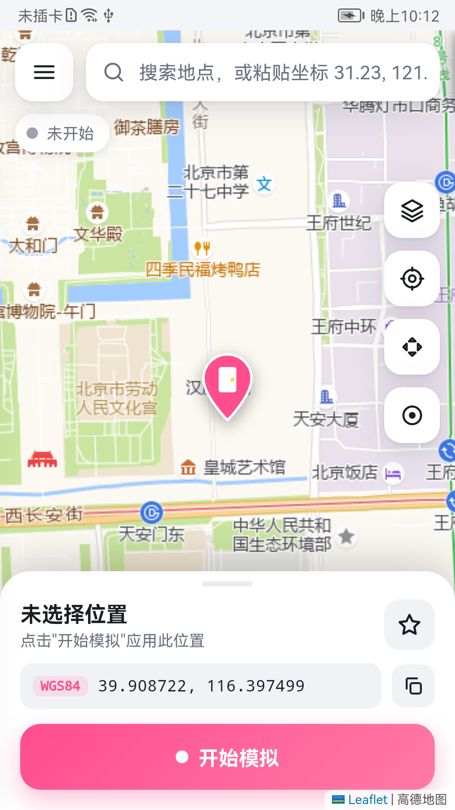
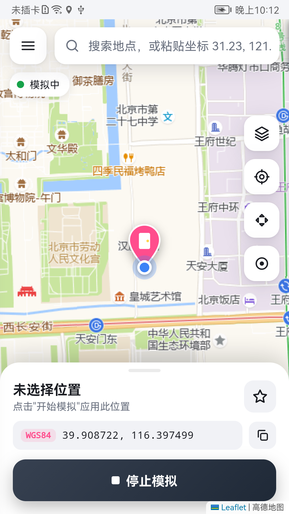
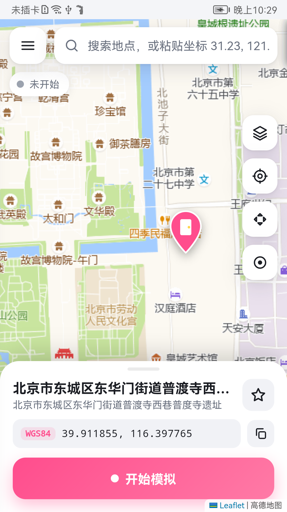

# 任意门 AnyDoor · 全局定位模拟

<p align="center">
  <a href="https://github.com/zhaoyuxiangyyds-lab/AnyDoor/releases/latest"></a>
  <a href="https://github.com/zhaoyuxiangyyds-lab/AnyDoor/releases"></a>
  
  
  <a href="LICENSE"></a>
  <a href="https://github.com/zhaoyuxiangyyds-lab/AnyDoor/stargazers"></a>
</p>

<p align="center"><b>简体中文</b> · <a href="README_EN.md">English</a></p>

**1.3.5 ColorOS/OxygenOS 等 ROM 模拟定位被拒修复 → 微信小程序/高德重新可定位**：[下载 APK 与升级说明](../../releases/tag/v1.3.5) · [完整更新记录](CHANGELOG.md)。修复 realme/一加 等 Android 16 机型上「环境检查全绿却报 `SecurityException … not allowed to perform MOCK_LOCATION`」「微信发送位置正常但小程序（哈啰）定位失败、高德报 errorCode 13」——根因是这些 ROM 即便 `appops` 显示已允许，系统框架仍拒绝 `OP_MOCK_LOCATION`，导致测试定位源注册失败、持续取位的应用拿不到坐标。现在在系统框架进程内**仅为本应用、仅对模拟定位这个 op** 放行，测试定位源在各 ROM 都能注册。**未在 ColorOS/OxygenOS 真机复测**，逻辑基于 AOSP `android16-release` 源码核对；升级后请完整重启一次手机。

<sub>更早：1.3.4 修复真实定位连续使用卡住，以及 Android 15/16 `getScanResults` 返回 `ParceledListSlice` 导致的 WiFi 屏蔽失效／网络定位泄漏。见 [更新记录](CHANGELOG.md)。</sub>


> 一个基于 Xposed 的安卓**全局虚拟定位**工具，界面美观、功能齐全，专为**中国网络环境**优化。
> 在系统服务内部改写通过系统定位接口下发的位置，并抹掉「模拟位置」标记；室内没有 GPS 信号也能持续输出坐标。

任意门是为了替代那些「搜不出地点、没有地图、只能填经纬度」的老式虚拟定位工具而写的。它把定位改在 `system_server` 里，面向使用系统定位接口的应用，开关随时切换、无需每次重启。

<p align="center">
  
  
  
</p>

---

## ✨ 功能特性

- **真·全局生效**：在 `system_server` 的 `LocationManagerService` 内改写定位，覆盖所有 App，而不是只 hook 单个应用。
- **反检测**：结果 `isFromMockProvider = false`；可选屏蔽 **WiFi 扫描 / 基站 / 原始 GNSS**，防止定位 SDK（高德、腾讯、百度）用周围环境反推真实位置。
- **持续输出**：同时通过测试定位源（mock provider）持续推送坐标，室内无 GPS 信号也有定位。
- **好用的地图界面**（WebView + Leaflet + 高德瓦片）：
  - 地点搜索（高德，中国可用）、点图选点、粘贴经纬度
  - **方向键微调** & **悬浮摇杆**（可在任意 App 上层实时走动）
  - **路线模拟**：设起点终点，按 **步行 / 跑步 / 骑行 / 驾车** 沿真实道路自动移动（高德路径规划）；速度随机波动、路口随机停顿、到达后原路返回或循环；也可手动画路径点
  - **计步同步**：模拟行走时同步伪造计步传感器（微信运动、Keep 等），可设步幅、直接"刷步数"
  - 收藏夹、历史记录、随机漂移、深浅色主题
- **一键隐私加固**：屏蔽 WiFi / 基站 / GNSS / 蓝牙环境 + 伪造 IMEI / IMSI / ICCID / Android ID / 序列号 + 屏蔽气压计；不依赖是否在模拟位置。说明里明确写了[做不到的部分](#-隐私加固的边界)。
- **坐标系自动纠偏**：内部统一 WGS-84（GPS 原始坐标），显示与高德瓦片按 GCJ-02 纠偏；支持粘贴 WGS84 / 火星 GCJ-02 / 百度 BD-09 坐标。
- **一键环境自检**：检测框架是否激活、作用域是否正确、权限是否到位，并可一键配置。

---

## 📋 环境要求

| 项目 | 要求 |
|------|------|
| 系统 | Android 8.1 ~ 16（SDK 27+）。已在 **华为 EMUI 9 / Android 9** 真机实测通过；较新版本使用 API 31+ 的 `ProviderProperties`；1.3.3 尚未进行各安卓版本真机回归，OEM 与目标应用兼容性需实测 |
| Root | 需要 Root |
| Xposed 框架 | **LSPosed** / **Vector**(JingMatrix) 等任意 Xposed 框架 |
| 架构 | 纯 Java，无 native，各架构通用 |

> ⚠️ 未 Root、无 Xposed 框架的设备无法使用本工具的全局功能。

---

## 🚀 安装与配置

### 1. 安装 APK
从 [Releases](../../releases) 下载 `AnyDoor.apk` 安装，或[自行编译](#-从源码编译)。

### 2. 在 Xposed 框架中启用模块
打开 LSPosed / Vector 管理器 → 模块 → 启用「任意门」，**作用域必须勾选**：

- ✅ **系统框架**（`android` / `system`）— 全局生效的关键
- ✅ **电话和通讯录**（`com.android.phone`）— 屏蔽基站定位、伪造 IMEI 等标识用
- ✅ **蓝牙**（`com.android.bluetooth`）— 隐私加固里屏蔽蓝牙扫描用（可选）
- ✅ **任意门自身**（`io.github.zhaoyuxiangyyds_lab.anydoor`）— 模块自检（目标应用的强化模式需单独勾选）

> 命令行框架（如 Vector CLI）可执行：
> ```sh
> cli scope set io.github.zhaoyuxiangyyds_lab.anydoor android/0 system/0 com.android.phone/0 com.android.bluetooth/0 io.github.zhaoyuxiangyyds_lab.anydoor/0
> ```

### 3. 重启一次手机
系统框架 hook 需要重启才能注入 `system_server`。**首次启用和每次升级都需要完整重启**，之后开关模拟无需再重启。

### 4. 打开 App，进入「环境检查」
确认应用／系统模块版本一致、系统配置已同步，并在目标应用请求定位后观察下发计数。尚未请求定位时，下发计数为 0 不代表失败。若「模拟位置权限」「悬浮窗权限」未授予，点 **一键 Root 配置** 即可。

### 5. 配置高德 Key（中国搜索地点必需）
中国网络下地点搜索走高德 REST API，需要一个**免费**的高德 Key（约 2 分钟，一次配置永久有效）：

1. 打开 [高德开放平台控制台](https://console.amap.com/dev/key/app) 并登录（首次需注册 [lbs.amap.com](https://lbs.amap.com/)）
2. 应用管理 → 创建应用 → 添加 Key
3. **服务平台务必选「Web服务」**（不是 Android / iOS / Web端JS API，否则会报 `INVALID_USER_KEY`）
4. 复制生成的 32 位 Key，填入 App 的 **设置 → 高德 Key**

> 首次搜索时 App 也会弹窗引导你申请。填 Key 之前，点图选点 / 粘坐标 / 摇杆 / 路线都能正常用，只有「按名字搜地点」需要 Key。

---

## 📖 使用方法

1. **选位置**：顶部搜索地点、粘贴坐标 `31.23, 121.47`、或直接点地图。
2. **开始模拟**：点底部 **开始模拟**。随后到环境检查确认同步，并在目标应用请求定位。
3. **微调 / 移动**：
   - 右侧 **方向键**（十字图标）：按固定步长微调
   - 右侧 **摇杆**（圆点图标）：弹出悬浮摇杆，可在其它 App 上层实时走动
   - 抽屉 → **路线模拟**：选终点（搜索 / 地图点选 / 收藏），选步行、跑步、骑行或驾车，点「规划路线」即沿真实道路生成路径；再调速度、波动、路口停顿和往返/循环，开始模拟
4. **停止**：再次点按钮，或下拉通知栏点「停止」。
5. **计步**（可选）：路线模拟页打开「伪造计步传感器」，把微信等目标 App 加入模块作用域并重启该 App，步数会随模拟行走增长；「刷步数」可在不移动的情况下按设定速率加步。
6. **隐私加固**（可选）：抽屉 → **隐私加固**，打开总开关即可；页面里能看到当前虚拟身份，可一键重新生成。

> 通知栏常驻一个「位置模拟中」的通知，可快速停止 / 呼出摇杆。

---

## ❓ 常见问题

**Q：显示「模拟中」但 App 位置没变？**
到「环境检查」确认「系统框架 Hook」为 ✓。若为 ✕，说明作用域没选「系统框架」或没重启，按上面第 2、3 步重来。
1.3.1 起环境检查多了一项「系统侧读取配置」——它是 `system_server` 自己汇报回来的：能不能读到配置文件、有没有读到「模拟中」，底部还列出各个 hook 的命中数（`last / report / accept / wifi`）。反馈问题时请把这一屏截图发出来。

**Q：环境检查里「系统侧读取配置」显示 ✕，或全部 ✓ 却毫无效果 / 高德刚打开一闪就跳回真实位置？**
不能仅凭这条现象断定根因。1.3.3 会区分模块版本不一致、配置读取失败、配置版本落后、心跳过期和定位源错误。先完整重启，再点击“一键 Root 配置”主动同步，开始模拟并在目标应用请求位置。仍有问题时使用“复制诊断”，同时提供目标应用版本和具体失败页面。Root 文件写入成功也不代表每台 ROM 的系统进程必然能读取，读取结果以系统探针为准。

**Q：高德地图 / 微信 / 用高德 SDK 的 App 一直拿不到模拟位置，或报 `errorCode=8`、`LatLng is error#0802`？**
请升级到 1.3.1 并重启一次手机。旧版有两个问题：① 伪造的 GPS 定位没带 `satellites` 卫星数，高德/百度/腾讯 SDK 会把这种「gps 定位」直接判定为模拟并丢弃；② 强化模式下 hook 了 `Location.hasAltitude()`，在 Android 12+ 上会打乱 `Location` 的 Parcel 布局，高德 `AMapLocation` 反序列化后经纬度变成乱码（就是 #0802）。另外 Android 11+ 的 WiFi 服务在单独的 APEX 类加载器里，旧版根本没 hook 到，WiFi 定位会泄露真实位置——1.3.1 已修。

**Q：搜索地点报 `INVALID_USER_KEY` / 搜不出来？**
高德 Key 类型不对。必须是「**Web服务**」类型，重新申请一个填入。

**Q：坐标对不上？**
App 内部统一用 WGS-84。从高德/百度网页复制的坐标是 GCJ-02/BD-09，请在 **设置 → 输入坐标系** 里选对应坐标系再粘贴。地图点选无需关心，已自动纠偏。

**Q：某些 App（如银行、打卡）识别出模拟？**
保持「屏蔽 WiFi / 基站定位」开启；把随机漂移设为 2~5 米；必要时在 Xposed 里把目标 App 也加进作用域（强化模式）。

**Q：想让某个 App 保留真实定位？**
设置 → 豁免应用，填入其包名（逗号分隔）。豁免应用同样不受隐私加固影响。

**Q：路径规划报错 / 没有路径？**
路径规划走高德「Web服务」API，需要 Key；步行规划单段上限 100 km。跨城请用驾车，或切到「手动路径点」自己画。

**Q：微信运动步数没变化？**
计步传感器数据在 App 进程内，系统框架拦不到：必须在 LSPosed 里把微信加进本模块作用域，并**杀掉重开微信**。手机本身要有计步传感器（`TYPE_STEP_COUNTER`）。

**Q：能不能让 IP 归属地也跟着变？**
不能。公网 IP 由网络路径决定，设备上任何 hook 都改不了；只有把流量从目标城市的机器转出去（比如在目标城市的云主机上跑 WireGuard，这是国内中转，不是翻墙）。好在手机流量的 IP 归属地通常只精确到省。

---

## 🔒 隐私加固的边界

「隐私加固」的目标是**让普通 App 拿不到能定位或识别这台手机的信息**。它做的事：所有 WiFi / 基站 / 原始 GNSS / 蓝牙扫描结果对 App 为空；`Settings.Secure.ANDROID_ID`、`Build.getSerial()`、IMEI / MEID / IMSI / ICCID / 本机号码返回一套固定的随机值；气压计事件被丢弃（加入作用域的 App）。

但下面这些**任何软件都做不到**，请不要相信声称能做到的工具：

| 做不到 | 原因 |
|------|------|
| 让运营商不知道你在哪 | 只要插着 SIM，基站就知道手机位置，这发生在基带与运营商之间，App 层 hook 碰不到。真要不可定位：飞行模式 + 拔卡。 |
| 改变 IP 归属地 | 由网络路径决定，见上面 FAQ。 |
| 在 GrapheneOS 上运行 | GrapheneOS 不能 Root、不能装 Xposed（会破坏验证启动），本模块无法运行。它自带的按 App 权限 / 网络 / 传感器开关已覆盖大部分需求。 |
| 伪造机型、OAID、账号 | 改 `Build.MODEL` 等极易导致 App 崩溃或封号，本工具不做；厂商广告 ID（OAID）走各厂商私有服务，未处理。 |
| 强化模式之外的传感器 / 客户端侧标识 | 传感器事件和部分标识读取在 App 进程内完成，只对加入作用域的 App 生效。 |

---

## 🔧 从源码编译

本项目**不用 Gradle**，用 Android SDK 裸工具链直接编译，轻量快速。

**依赖**：JDK 17、Android SDK（`build-tools;34.0.0` + `platforms;android-34`）。

```bash
# 1. 按需修改 build.sh 顶部的 SDK / JDK 路径
#    SDK 默认 D:/Android/Sdk，JAVA_HOME 默认指向本机 JDK17
# 2. 编译（Git Bash / WSL / Linux / macOS 均可）
bash build.sh
# 产物：AnyDoor.apk（首次会自动生成本地调试签名 keystore.jks）
```

`build.sh` 流程：`aapt2 compile/link` → `javac` → `d8` → 打包 `classes.dex` → `zipalign` → `apksigner` 签名。

> `keystore.jks` 是本地自动生成的调试签名，已被 `.gitignore` 排除；克隆后首次 `build.sh` 会自动新建一个。

---

## 🧠 工作原理

| 层 | 说明 |
|----|------|
| **系统层**（`SystemHooks`） | Hook 最后位置与逐接收者下发：Android ≤ 11 使用 Receiver，Android 12+ 使用各 Registration 的 `acceptLocationChange`。不再在 `onReportLocation` 提前替换系统缓存；保留原始 mock 缓存标记供系统停止测试源时清理。 |
| **电话层**（`PhoneHooks`） | hook `PhoneInterfaceManager`，对普通 App 隐藏基站信息。 |
| **应用层**（`AppHooks`） | 对加入作用域的 App 额外 hook `Location` getter（仅 gps/network/fused/passive 来源）、`isFromMockProvider`、`getLastKnownLocation` 等，二次兜底。不 hook `hasAltitude()` 之类决定 Parcel 布局的方法。 |
| **驱动**（`SpoofService`） | 前台服务，用 `addTestProvider` + `setTestProviderLocation` 持续推送坐标，实现路线移动、摇杆、随机漂移；室内无信号也有定位。 |
| **配置** | 私有 SharedPreferences + 标准 XSharedPreferences API；Root 原子快照供系统读取，受定位权限约束的系统状态桥供作用域内进程读取。带协议、递增版本和 15 秒运行心跳有效期，不再声明 `xposedsharedprefs`。 |
| **界面** | `WebView` 承载单页应用（`assets/web/`），`JsBridge` 做 JS↔Java 桥接；地图用 Leaflet + 高德瓦片。 |

> 兼容性注意：不同 Xposed 分支交付 `system_server` 的包名可能是 `android` 或 `system`，本项目两者都处理。

---


### 1.3.3 升级与反馈

- 覆盖安装后**完整重启手机**，再打开任意门。首次升级会在后台迁移旧 NSP 设置／收藏；按提示授予 Root。迁移失败可重试，原文件保留，不自动恢复旧的“模拟中”状态。
- 请在手机主用户安装任意门并控制全局定位。目标应用分身／工作资料需要按对应用户配置作用域；本版尚未对这些环境真机验证。
- 设置了豁免应用时，驱动会停用全局测试定位源，避免覆盖豁免应用的真实来源。这时其他应用依赖实际系统定位回调，室内可能需要等待。
- “系统模块响应”“配置同步”“下发计数”分别表示不同阶段。即使计数增加，也不能保证某个微信或钉钉页面最终采用该坐标。
- 反馈请附“环境检查 → 复制诊断”、目标应用版本、失败表现（真实位置／一直定位／环境异常）及是否分身。诊断不包含坐标、收藏、设备伪造标识和高德 Key。

### 开发者验证

`python tests/run.py`：需要 JDK 17、Node、Python、Android SDK 与 Bash；可通过 `ANDROID_SDK_ROOT`、`ANDROID_JAR`、`TEST_BASH` 配置路径。测试依赖固定版本 JSON／KXML 并验证 SHA-256。测试输出在 `build/tests/`，不提交产物。详见 [测试说明](tests/README.md)。

本项目作者：[zhaoyuxiangyydslab](https://github.com/zhaoyuxiangyyds-lab)。本版修复与测试由 Codex 协助。

## 🌟 支持一下

如果这个项目对你有帮助，请点一个 **Star** ⭐ —— 这是对开源作者最直接的鼓励，也能让更多人找到它。
遇到问题欢迎提 [Issue](../../issues)，有想法欢迎到 [Discussions](../../discussions) 聊聊。

---

## ⚠️ 免责声明

本项目仅供**学习研究**与在**本人拥有的设备**上做定位测试之用。请勿用于任何违反法律法规、平台服务条款或侵害他人权益的用途。使用本工具产生的一切后果由使用者自行承担。

---

## 🙏 致谢

- 参考了 [android-gps-setter](https://github.com/jqssun/android-gps-setter) 的 Xposed 定位 hook 思路。
- 地图瓦片来自高德地图，地图库为 [Leaflet](https://leafletjs.com/)。

## 📄 License

[MIT](LICENSE)
